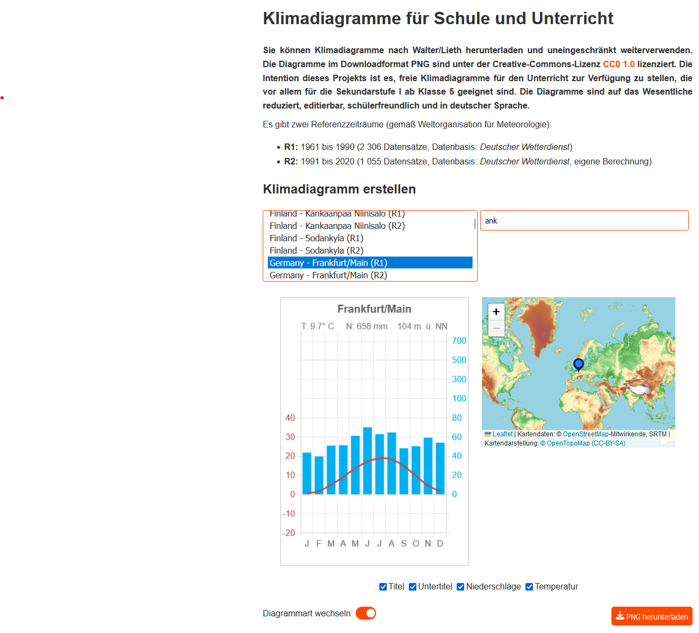
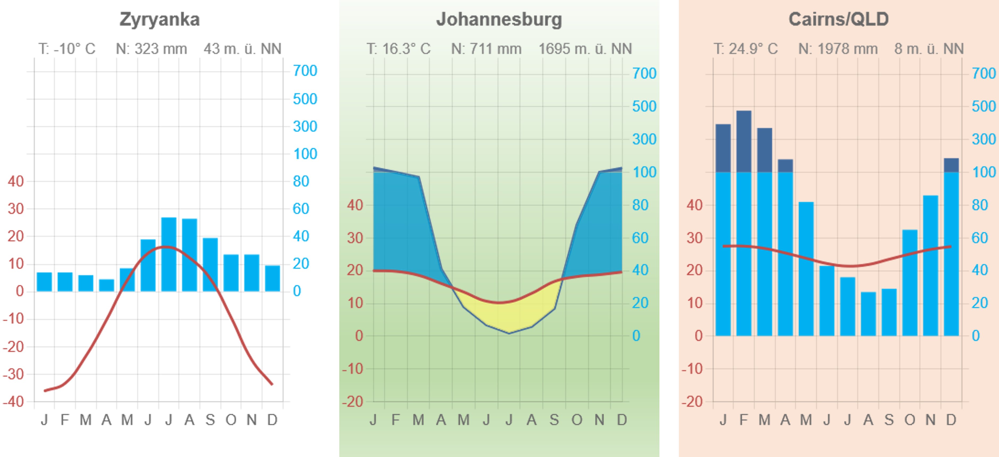

# Klimadiagramme für Schule und Unterricht
Mit dieser Anwendung kann man Walter/Lieth-Klimadiagramme erstellen, herunterladen und frei verwenden. Ziel ist es, freie Klimadiagramme bereitzustellen, die besonders für die Sekundarstufe I ab Klasse 5 oder 6 geeignet sind. Die Diagramme sind auf das Wesentliche reduziert, editierbar, schülerfreundlich (Niederschlag als Säulendiagramm) und in deutscher Sprache. Die Daten basieren auf den monatlichen Niederschlags- und Temperaturwerten des Deutschen Wetterdienstes.

## Screenshot

## Referenzzeiträume
Es stehen zwei Referenzzeiträume zur Verfügung:

    R1: 1961 bis 1990 (2 306 Datensätze, Quelle: DWD)
    R2: 1991 bis 2020 (1 055 Datensätze, Quelle: DWD, eigene Berechnung)

   

<i>Diagrammevergleich: links R1 und rechts R2</i>

<i>Die zwei üblichen Diagrammarten stehen zur Verfügung. Der Hintergrund kann nach dem Herunterladen leicht in allen Programmen nachbarbeitet werden.</i>

## Manuelle Daten
Es gibt die Möglichkeit, die Temperatur- und Niederschlagsdaten im Diagramm manuell zu überschreiben. 

Beispiel für die Eingabe von Temperatur- und Niederschlagsdaten:

Temperatur: 0;3;5;7;8;9;11;14;13;12;8;5
Niederschlag: 20;50;100;200;260;200;655;100;100;110;30;20

Hier steht "0" für Januar, "3" für Februar und so weiter. Der Strichpunkt (;) trennt die monatlichen Werte.

Viel Spaß beim Erstellen der Klimadiagramme!
