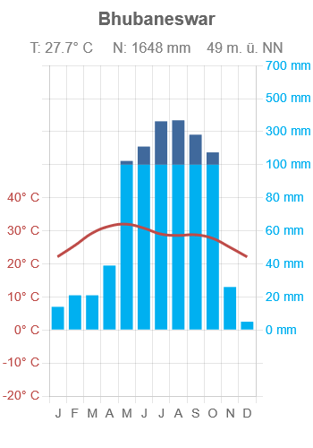
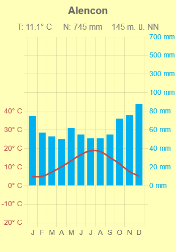
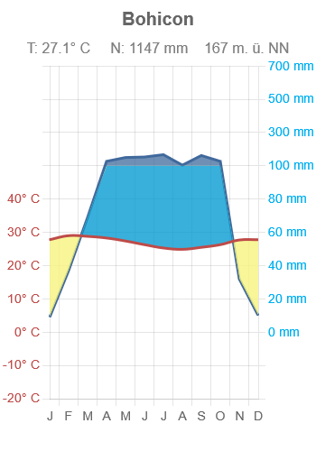
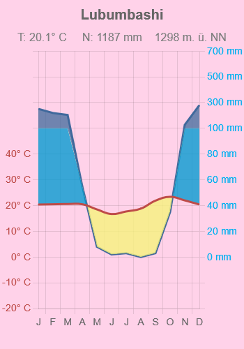

# Klimadiagramme für Schule und Unterricht
Sie können Klimadiagramme nach Walter/Lieth herunterladen und uneingeschränkt weiterverwenden. Die Diagramme im Downloadformat PNG sind unter der Creative-Commons-Lizenz CC0 1.0 lizenziert. Die Intention dieses Projekts ist es, freie Klimadiagramme für den Unterricht zur Verfügung zu stellen, die vor allem für die Sekundarstufe I ab Klasse 5 geeignet sind. Die Diagramme sind auf das Wesentliche reduziert, editierbar, schülerfreundlich und in deutscher Sprache.

Es stehen zwei Referenzzeiträume zur Verfügung:

* R1: 1961 bis 1990 (2 306 Datensätze, Quelle: DWD)
* R2: 1991 bis 2020 (1 055 Datensätze, Quelle: DWD, eigene Berechnung)

     
